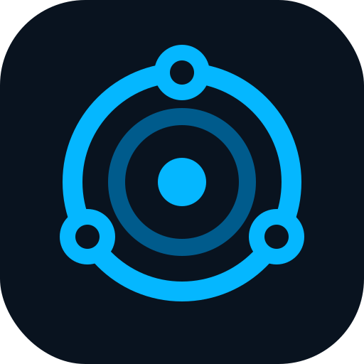

<div align="center">

<a href="https://github.com/manuamest/Localdeck">

</a>

# Localdeck

**Zero-config local dashboard for developers.**


</div>

Localdeck answers one question: what web applications are currently running on your localhost? It scans common development ports, probes HTTP services, and shows live services as visual cards — no config required.


## How it works

```bash
docker run --network host ghcr.io/manuamest/localdeck
```

Then open `http://localhost:4888`. No config required — or mount the Docker socket for richer metadata:

```bash
docker run --network host -v /var/run/docker.sock:/var/run/docker.sock:ro ghcr.io/manuamest/localdeck
```

### Running from source

1. Run `docker compose up --build` in the project root.
2. Open `http://localhost:4888` in your browser.
3. Localdeck automatically scans common dev ports, detects running services, and displays them as cards with title, favicon, and runtime classification.
4. Filter by type, sort by port or name, or trigger a manual rescan — all from the UI.

That's it. Zero configuration needed.

## Features

- **Zero-Config Discovery:** Detects local web apps instantly — Docker, Docker Compose, Python, Node.js, and more.
- **Rich Service Cards:** Shows title, favicon, framework classification, and detected endpoints for each service.
- **Smart Filtering & Sorting:** Filter by runtime type (JavaScript, Python, Docker, ML, Other) and sort by port or name.
- **Favorites:** Pin important services to the top with one click. Persists across sessions.
- **Aliases:** Rename any service with a custom label — double-click the title to edit inline.
- **Archive:** Hide services you don't need right now; restore them any time from the Archived section.
- **Manual Services:** Add any URL as a service card with the `+` button, no scanning needed.
- **Docker Metadata Enrichment:** Mount the Docker socket (read-only) for container and Compose project metadata.
- **Privacy First:** Scans only local/private hosts. No external network access. No data leaves your machine.

<div align="center">

## Support

If you find Localdeck useful, consider supporting the project:

[](https://www.buymeacoffee.com/manuamest)

</div>
